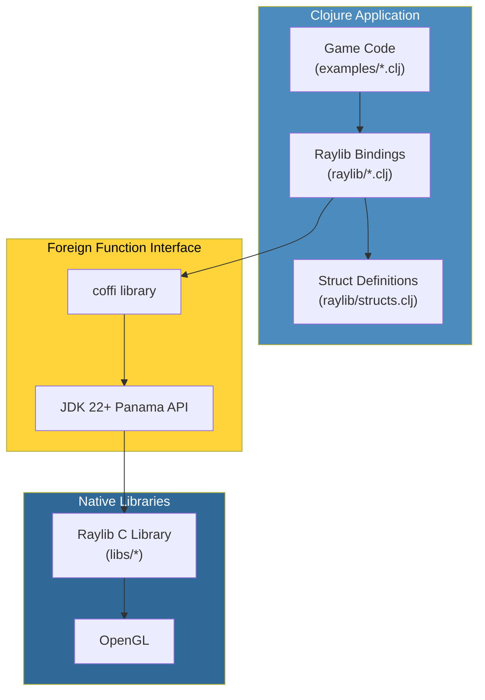
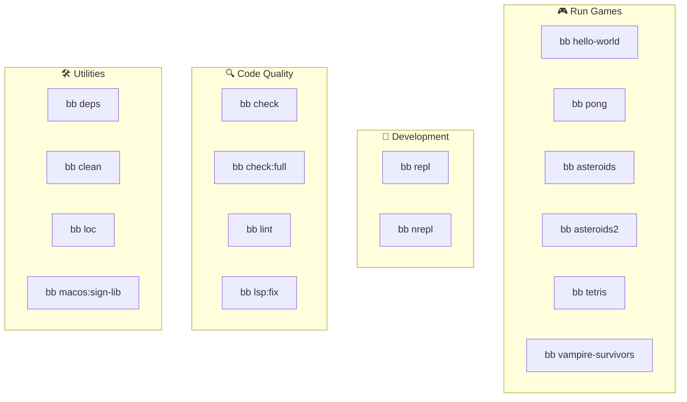

# Raylib Clojure Playground

A collection of game development experiments using [raylib](https://www.raylib.com/)
in Clojure. It calls raylib's C library directly through
[coffi](https://github.com/IGJoshua/coffi) over JDK 22+'s Foreign Function &
Memory API (Project Panama) — no wrapper library, no codegen.

78 examples ship in `src/examples/`: original games plus ports of raylib's own
C examples across the core, shapes, text, textures, shaders, audio, and models
categories.

This project began as
[ertugrulcetin/raylib-clojure-playground](https://github.com/ertugrulcetin/raylib-clojure-playground)
and still carries its history; the FFI binding layer is largely his. See
[NOTICE](NOTICE) for the full attribution.

## Architecture Overview



## What You Need

- **JDK 22 or newer** (required for the Foreign Function API)
- **Clojure CLI** (recommended) or Leiningen
- **Babashka** (optional, for task automation)

## Getting Started

### Quick Start with Babashka (Recommended)

If you have Babashka installed, running games is simple:

```bash
bb help              # Show all available commands
bb info              # Grouped task cheat-sheet (start here to review the project)
bb asteroids         # Run Asteroids game
bb tetris            # Run Tetris game
```

### Using Clojure CLI

```bash
clj -M:asteroids     # Run Asteroids
clj -M:tetris        # Run Tetris
clj -M:pong          # Run Pong
clj -M:hello-world   # Run Hello World
```

### Using Leiningen

```bash
lein run                        # Run default (Asteroids)
lein run -m examples.tetris     # Run Tetris
```

## Babashka Tasks

This project includes comprehensive Babashka tasks for development workflow:



### 🎮 Running Games

| Command | Description |
|---------|-------------|
| `bb hello-world` | Basic window test - verify your setup works |
| `bb bouncing-ball` | Simple physics with gravity toggle |
| `bb screen-manager` | State machine for game screens |
| `bb pong` | Classic two-player paddle game |
| `bb following-eyes` | Eyes that follow mouse cursor |
| `bb asteroids` | Shoot asteroids and survive |
| `bb asteroids2` | Alternate asteroids version |
| `bb tetris` | Block-stacking puzzle game |
| `bb vampire-survivors` | Survival action game |
| `bb input-keys` | Keyboard input demo |
| `bb input-mouse` | Mouse input demo |
| `bb mouse-wheel` | Mouse wheel scrolling |
| `bb input-gamepad` | Gamepad visualization |
| `bb gestures-testbed` | Touch gesture detection |
| `bb collision-area` | Collision detection demo |
| `bb colors-palette` | Raylib color showcase |
| `bb logo-anim` | Logo animation demo |
| `bb scissor-test` | Scissor mode clipping |
| `bb random-values` | Random number generation |
| `bb camera-2d` | 2D camera with zoom/rotation |
| `bb camera-3d-free` | Free-form 3D camera |
| `bb split-screen-3d` | Two-player 3D split screen |
| `bb first-person-3d` | First person camera |
| `bb camera-fps` | Advanced FPS camera |
| `bb world-screen` | 3D to 2D coordinates |
| `bb picking-3d` | Ray casting object selection |
| `bb background-scrolling` | Parallax scrolling |
| `bb sprite-animation` | Spritesheet animation |
| `bb basic-lighting` | Shader-based lighting |
| `bb audio-module` | Music visualization |
| `bb sound-loading` | Basic WAV/OGG playback |
| `bb music-stream` | MP3 streaming with controls |
| `bb sound-multi` | Multiple sound instances |
| `bb logo-raylib` | Raylib logo drawn with shapes |
| `bb logo-raylib-anim` | Animated logo construction |
| `bb basic-shapes` | Shape drawing showcase |
| `bb rectangle-scaling` | Drag to resize rectangle |
| `bb mouse-trail` | Mouse trail effect |
| `bb lines-bezier` | Interactive bezier curve |
| `bb easings-ball` | Easing function animation |
| `bb writing-anim` | Typewriter text effect |
| `bb format-text` | Formatted text display |
| `bb input-box` | Text input field |
| `bb window-should-close` | Custom close confirmation |
| `bb camera-2d-platformer` | Platformer camera modes |
| `bb ball-physics` | Grab and throw balls |
| `bb simple-particles` | Water/smoke/fire particles |
| `bb dashed-line` | Interactive dashed line |
| `bb starfield-effect` | 3D starfield simulation |
| `bb easings-box` | Box animation with easing functions |
| `bb double-pendulum` | Chaotic pendulum simulation |
| `bb lines-drawing` | Draw rainbow lines on canvas |
| `bb easings-rectangles` | Grid animation with easing |
| `bb window-letterbox` | Resolution-independent rendering |

### 🔧 Development

| Command | Description |
|---------|-------------|
| `bb repl` | Start Clojure REPL for interactive development |
| `bb nrepl` | Start nREPL server on port 7999 (for non-GUI work) |

> **For live game development:** Run a game (`bb asteroids`) then connect your editor to port **7888**.

### 🔍 Code Quality

| Command | Description |
|---------|-------------|
| `bb check` | ⭐ Fast checks (compile + lint) - use before committing |
| `bb check:full` | Comprehensive checks (compile + lint + LSP) |
| `bb lint` | Run clj-kondo linter |
| `bb lsp:format` | Format all Clojure files |
| `bb lsp:clean-ns` | Clean and organize namespace forms |
| `bb lsp:fix` | Auto-fix formatting + namespace issues |
| `bb lsp:check` | Run all LSP checks (dry run) |

### 📦 Dependencies

| Command | Description |
|---------|-------------|
| `bb deps` | Download and cache all dependencies |
| `bb deps:tree` | Show dependency tree |
| `bb outdated` | Check for outdated dependencies |

### 🛠️ Utilities

| Command | Description |
|---------|-------------|
| `bb clean` | Clean build artifacts (target, .cpcache) |
| `bb loc` | Count lines of code |
| `bb tree` | Show project structure |
| `bb macos:sign-lib` | Sign raylib library for macOS security |
| `bb hooks:install` | Install git pre-commit hook |
| `bb help` | Show colorful help menu |
| `bb info` | Grouped cheat-sheet of every bb task (self-updating; start here) |

## Bundled Libraries

This project includes pre-built Raylib 5.5.0 libraries for different platforms:

| Platform | Directory | Library |
|----------|-----------|---------|
| macOS (Intel/ARM) | `libs/macos` | `libraylib.5.5.0.dylib` |
| Linux 64-bit | `libs/linux_amd64` | `libraylib.so.5.5.0` |
| Linux 32-bit | `libs/linux_i386` | `libraylib.a` |
| Windows 64-bit | `libs/win64_msvc16` | `raylib.dll` |
| Windows 32-bit | `libs/win32_msvc16` | `raylib.dll` |

The correct library is loaded automatically based on your operating system.

### macOS Code Signing

On macOS, you might see a security warning about the library. Fix it with:

```bash
bb macos:sign-lib
```

Or manually:

```bash
codesign --force --sign - libs/macos/libraylib.5.5.0.dylib
```

## Documentation

Full guide: [`docs/guide/`](docs/guide/index.md)

- [`getting-started.md`](docs/guide/getting-started.md) — full install
  walkthrough (per-OS), IDE setup, connecting to the embedded/standalone
  nREPL
- [`architecture.md`](docs/guide/architecture.md) — module layout,
  project structure diagram
- [`adding-ffi-bindings.md`](docs/guide/adding-ffi-bindings.md) —
  `defcfn`/`defalias`, the type-mapping table, a worked example
- [`coffi-panama-internals.md`](docs/guide/coffi-panama-internals.md) —
  what happens under the hood on the JDK Panama FFI
- [`example-architecture-patterns.md`](docs/guide/example-architecture-patterns.md) —
  the shared example skeleton and the recipe for porting a new one
- [`repl-workflow.md`](docs/guide/repl-workflow.md) — live game
  development over the embedded nREPL
- [`example-catalog.md`](docs/guide/example-catalog.md) — all 78
  examples, grouped and tabulated, with a preview-thumbnail column
- [`demos.md`](docs/guide/demos.md) — the full-size demo gallery (every
  example's animated GIF, one-line description)
- [`troubleshooting.md`](docs/guide/troubleshooting.md) — common errors
  and fixes
- [`docs/demos/`](docs/demos/README.md) — animated GIF previews, one per
  example

Every GIF under `docs/demos/` is committed, so you never need to record
anything. Regenerating them (`bb record`) drives a screen-capture tool that
is not publicly released, so it is maintainer-only — the task says so and
exits cleanly rather than failing obscurely. Its input timelines live in
[`scripts/demo_manifest.edn`](scripts/demo_manifest.edn) if you want to
propose one for a new example.

## Controls

Most examples share these common controls:

| Key | Action |
|-----|--------|
| F1 | Toggle debug overlay (FPS, memory) |
| F11 | Toggle fullscreen |
| Q / Window Close | Exit game |

### Pong

| Key | Action |
|-----|--------|
| W / S | Move left paddle up/down |
| K / J | Move right paddle up/down |
| Enter | Start game |

### Bouncing Ball

| Key | Action |
|-----|--------|
| Space | Pause/resume ball movement |
| G | Toggle gravity on/off |
| Q | Exit |

### Following Eyes

| Key | Action |
|-----|--------|
| Mouse | Move to make eyes follow |
| Q | Exit |

### Screen Manager

| Key | Action |
|-----|--------|
| Enter | Navigate between screens |
| Q | Exit |

### Asteroids

| Key | Action |
|-----|--------|
| ← → | Rotate ship |
| ↑ | Thrust forward |
| ↓ | Thrust backward |
| Space | Shoot / Restart after death |

### Tetris

| Key | Action |
|-----|--------|
| ← → | Move piece |
| ↑ | Rotate piece |
| ↓ | Soft drop |
| Space | Hard drop |

## Contributing

New examples are very welcome — the suite is deliberately mechanical to grow,
and one new example touches exactly four places.

See **[CONTRIBUTING.md](CONTRIBUTING.md)** for setup, the pre-PR gates, and the
four-touchpoint recipe.

## Credits

- **[Ertuğrul Çetin](https://github.com/ertugrulcetin)** — this project began as
  his [raylib-clojure-playground](https://github.com/ertugrulcetin/raylib-clojure-playground).
  The coffi binding layer under `src/raylib/` is his design, several of its
  files are unchanged from his originals, and six examples (asteroids,
  asteroids2, hello-world, pong, tetris, vampire-survivors) started as his work.
- **[raylib](https://www.raylib.com/)** — Ramon Santamaria ([@raysan5](https://github.com/raysan5)).
  Most examples here are ports of raylib's own C examples.
- **[coffi](https://github.com/IGJoshua/coffi)** — Joshua Suskalo. Every
  `defcfn` in `src/raylib/` is coffi's.
- **Asteroids math** — based on [janetroids](https://github.com/tantona/janetroids)
  by [@cellularmitosis](https://github.com/tantona).

## License

[zlib](LICENSE) — the same license as raylib itself, so the terms of the many
examples ported from raylib carry through unchanged.

Two caveats, both detailed in [NOTICE](NOTICE):

- **`libs/` redistributes prebuilt raylib 5.5.0 binaries** (macOS, Linux,
  Windows) so the examples run without a system raylib install. They are
  raylib's own release artifacts, unmodified, under raylib's zlib license.
- **`resources/` media is not covered by this license.** Those are raylib's
  example assets under their own terms — mostly CC0, and one
  (`resources/scarfy.png`) under **CC-BY-NC**, which is non-commercial. Per-file
  authorship and terms: [resources/LICENSE.md](resources/LICENSE.md).
