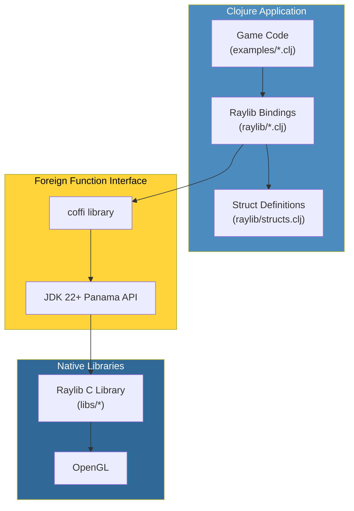
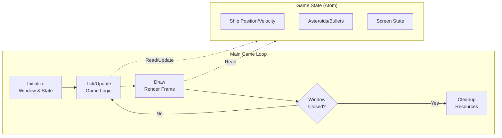
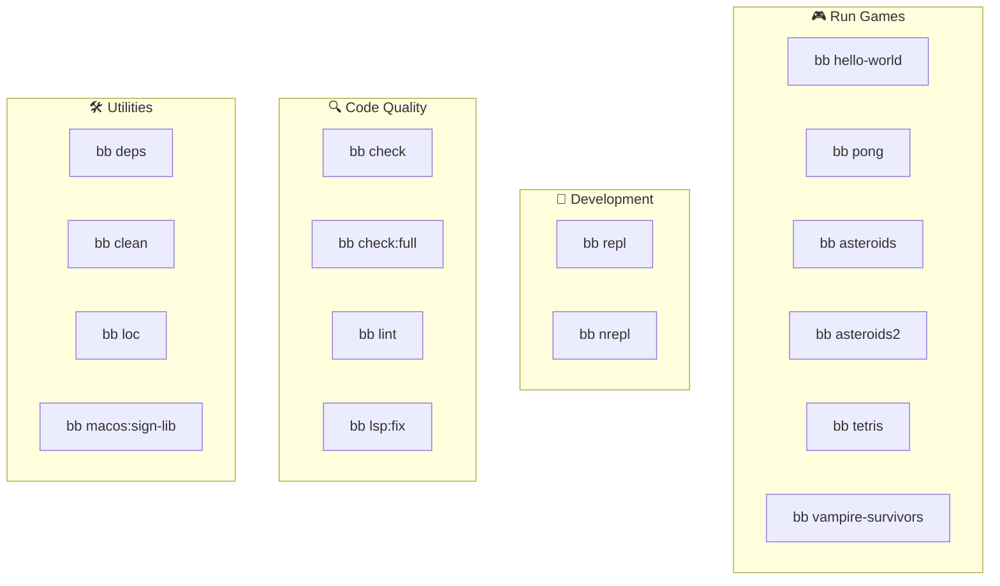
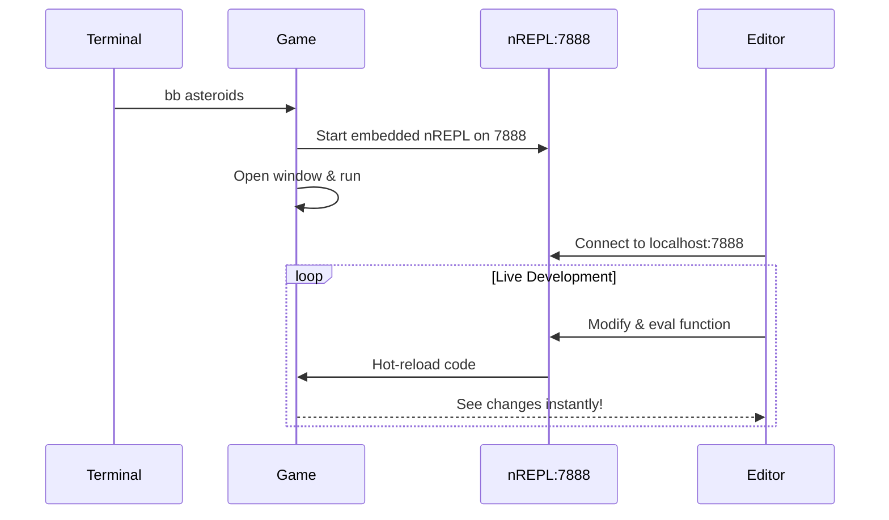
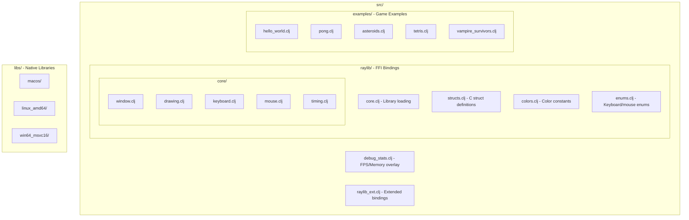
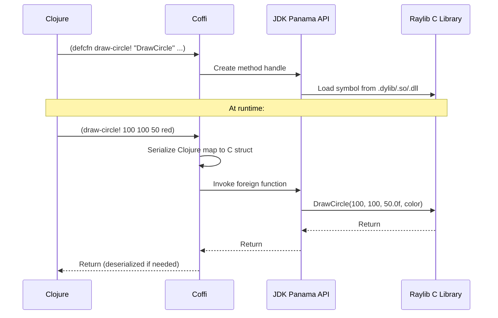

# Raylib Clojure Playground

A collection of game development experiments using Raylib in Clojure. This project uses coffi for FFI bindings to call Raylib's C library directly from Clojure.

## Architecture Overview



## Game Loop Architecture



## What You Need

- **JDK 22 or newer** (required for the Foreign Function API)
- **Clojure CLI** (recommended) or Leiningen
- **Babashka** (optional, for task automation)

## Installing the Prerequisites

### JDK 22+

Clojure runs on the JVM, so you need Java installed. This project requires JDK 22 or later because we use the new Foreign Function API to call native code.

On macOS with Homebrew:

```bash
brew install openjdk@22
```

On Linux (Ubuntu/Debian):

```bash
sudo apt install openjdk-22-jdk
```

Alternatively, you can use SDKMAN which works on macOS, Linux, and Windows (WSL):

```bash
curl -s "https://get.sdkman.io" | bash
source "$HOME/.sdkman/bin/sdkman-init.sh"
sdk install java 22.0.2-open
```

### Clojure CLI (Recommended)

The Clojure CLI is the modern way to run Clojure projects using `deps.edn`.

On macOS with Homebrew:

```bash
brew install clojure/tools/clojure
```

On Linux:

```bash
curl -L -O https://github.com/clojure/brew-install/releases/latest/download/linux-install.sh
chmod +x linux-install.sh
sudo ./linux-install.sh
```

Verify installation:

```bash
clj --version
```

### Babashka (Optional but Recommended)

Babashka provides fast task automation for Clojure projects.

On macOS with Homebrew:

```bash
brew install borkdude/brew/babashka
```

On Linux:

```bash
bash < <(curl -s https://raw.githubusercontent.com/babashka/babashka/master/install)
```

Verify installation:

```bash
bb --version
```

### Leiningen (Alternative)

If you prefer Leiningen over the Clojure CLI:

On macOS with Homebrew:

```bash
brew install leiningen
```

On Linux:

```bash
curl -O https://raw.githubusercontent.com/technomancy/leiningen/stable/bin/lein
chmod +x lein
sudo mv lein /usr/local/bin/
lein  # This will download the rest automatically
```

## Getting Started

Clone this repository:

```bash
git clone https://github.com/ertugrulcetin/raylib-clojure-playground.git
cd raylib-clojure-playground
```

### Quick Start with Babashka (Recommended)

If you have Babashka installed, running games is simple:

```bash
bb help              # Show all available commands
bb asteroids         # Run Asteroids game
bb tetris            # Run Tetris game
```

### Using Clojure CLI

```bash
clj -M:asteroids     # Run Asteroids
clj -M:tetris        # Run Tetris
clj -M:pong          # Run Pong
clj -M:hello-world   # Run Hello World
```

### Using Leiningen

```bash
lein run                        # Run default (Asteroids)
lein run -m examples.tetris     # Run Tetris
```

### Setting JAVA_HOME

If you have multiple Java versions installed, you may need to set JAVA_HOME:

```bash
export JAVA_HOME=/path/to/jdk-22
```

On macOS with Homebrew:

```bash
export JAVA_HOME=/opt/homebrew/opt/openjdk@22
```

## Babashka Tasks

This project includes comprehensive Babashka tasks for development workflow:



### 🎮 Running Games

| Command | Description |
|---------|-------------|
| `bb hello-world` | Basic window test - verify your setup works |
| `bb bouncing-ball` | Simple physics with gravity toggle (⭐ Beginner) |
| `bb screen-manager` | State machine for game screens (⭐ Beginner) |
| `bb pong` | Classic two-player paddle game (⭐⭐ Easy) |
| `bb following-eyes` | Eyes that follow mouse cursor (⭐⭐ Easy) |
| `bb asteroids` | Shoot asteroids and survive (⭐⭐⭐ Intermediate) |
| `bb asteroids2` | Alternate asteroids version (⭐⭐⭐ Intermediate) |
| `bb tetris` | Block-stacking puzzle game (⭐⭐⭐ Intermediate) |
| `bb vampire-survivors` | Survival action game (⭐⭐⭐⭐ Advanced) |

### 🔧 Development

| Command | Description |
|---------|-------------|
| `bb repl` | Start Clojure REPL for interactive development |
| `bb nrepl` | Start nREPL server on port 7889 (for non-GUI work) |

> **For live game development:** Run a game (`bb asteroids`) then connect your editor to port **7888**.

### 🔍 Code Quality

| Command | Description |
|---------|-------------|
| `bb check` | ⭐ Fast checks (compile + lint) - use before committing |
| `bb check:full` | Comprehensive checks (compile + lint + LSP) |
| `bb lint` | Run clj-kondo linter |
| `bb lsp:format` | Format all Clojure files |
| `bb lsp:clean-ns` | Clean and organize namespace forms |
| `bb lsp:fix` | Auto-fix formatting + namespace issues |
| `bb lsp:check` | Run all LSP checks (dry run) |

### 📦 Dependencies

| Command | Description |
|---------|-------------|
| `bb deps` | Download and cache all dependencies |
| `bb deps:tree` | Show dependency tree |
| `bb outdated` | Check for outdated dependencies |

### 🛠️ Utilities

| Command | Description |
|---------|-------------|
| `bb clean` | Clean build artifacts (target, .cpcache) |
| `bb loc` | Count lines of code |
| `bb tree` | Show project structure |
| `bb macos:sign-lib` | Sign raylib library for macOS security |
| `bb hooks:install` | Install git pre-commit hook |
| `bb help` | Show colorful help menu |

## IDE Setup

Clojure development is best experienced with a good editor that supports REPL integration.

### VS Code with Calva

1. Install VS Code
2. Install the "Calva" extension
3. Open this project folder
4. Press `Ctrl+Alt+C` then `Ctrl+Alt+J` (or `Cmd` on macOS) to start a REPL
5. Select "deps.edn" when prompted

Calva provides syntax highlighting, inline evaluation, and a connected REPL. Evaluate code by placing your cursor on an expression and pressing `Ctrl+Enter`.

### IntelliJ IDEA with Cursive

1. Install IntelliJ IDEA (Community or Ultimate)
2. Install the "Cursive" plugin
3. Open this project folder
4. Cursive will detect `deps.edn` and set everything up

To start a REPL, right-click on `deps.edn` and select "Run REPL".

### Connecting to nREPL

**For live game development (recommended):**

```bash
bb asteroids   # Starts game + nREPL on port 7888
```

Then connect your editor to `localhost:7888`.

**For standalone REPL (non-GUI work):**

```bash
bb nrepl   # Starts nREPL on port 7889
```

Then connect your editor to `localhost:7889`.

## REPL Development

One of the best things about Clojure is the REPL workflow. You can change code while the game is running and see changes immediately.

### Live Game Development (Recommended)

Each game starts an **embedded nREPL server on port 7888**. This is the proper way to do live development:



**Step 1:** Start a game (it launches nREPL automatically):

```bash
bb asteroids   # or: clojure -M:asteroids
```

You'll see in the logs:
```
INFO: starting nREPL server on port 7888
```

**Step 2:** Connect your editor to `localhost:7888`:
- **VS Code/Calva**: Run "Calva: Connect to a Running REPL Server"
- **IntelliJ/Cursive**: Run → Edit Configurations → Remote REPL

**Step 3:** Modify code live! Try these from your connected REPL:

```clojure
;; Access the running game state
@examples.asteroids/game-atom

;; Reset the game
(reset! examples.asteroids/game-atom (examples.asteroids/initial-state))

;; Make the ship bigger
(swap! examples.asteroids/game-atom assoc-in [:ship :size] 50)

;; Spawn more asteroids
(swap! examples.asteroids/game-atom update :asteroids 
       concat (repeatedly 5 examples.asteroids/make-asteroid))
```

### macOS Note

On macOS, OpenGL requires the main thread (`-XstartOnFirstThread`). This means:
- ❌ You **cannot** run games from a standalone REPL (`clj -M:dev`)
- ✅ You **must** run the game first, then connect to its embedded nREPL

### Standalone REPL (Non-GUI Work)

For exploring code, testing logic, or non-GUI work, use the standalone REPL:

```bash
bb nrepl   # or: clj -M:dev (starts on port 7889)
```

> **Port note:** Standalone REPL uses port **7889** to avoid conflicts with games that use **7888**.

What works from standalone REPL:

```clojure
;; Load and explore FFI bindings
(require '[raylib.colors :as colors])
(require '[raylib.enums :as enums])

;; Colors are just Clojure maps!
colors/red
;; => {:r 230, :g 41, :b 55, :a 255}

;; Create custom colors
(def my-purple {:r 128 :g 0 :b 255 :a 255})

;; Test game logic (pure functions)
(require '[examples.asteroids :as ast])

(ast/vector-add [1 2] [3 4])
;; => [4 6]

(ast/check-point-circle [100 100] [100 100] 50)
;; => true (collision!)

;; Explore game state structure
(keys (ast/initial-state))
;; => (:bullets :screen :dt :alive :asteroids :ship ...)
```

### REPL Capabilities Summary

| Capability | Standalone REPL | Connected to Game |
|------------|-----------------|-------------------|
| Load FFI bindings | ✅ | ✅ |
| Inspect colors/enums | ✅ | ✅ |
| Test pure game logic | ✅ | ✅ |
| Open windows/render | ❌ (macOS) | ✅ |
| Modify running game | ❌ | ✅ |
| Hot-reload functions | ❌ | ✅ |

## Available Examples

| Example | Description | Complexity |
|---------|-------------|------------|
| Hello World | Basic window with text | ⭐ Beginner |
| Bouncing Ball | Simple physics with gravity toggle | ⭐ Beginner |
| Screen Manager | State machine for game screens | ⭐ Beginner |
| Pong | Two-player paddle game | ⭐⭐ Easy |
| Following Eyes | Eyes that follow mouse cursor | ⭐⭐ Easy |
| Asteroids | Shoot asteroids and survive | ⭐⭐⭐ Intermediate |
| Asteroids 2 | Alternate version with variations | ⭐⭐⭐ Intermediate |
| Tetris | Block-stacking puzzle | ⭐⭐⭐ Intermediate |
| Vampire Survivors | Survival action game | ⭐⭐⭐⭐ Advanced |

## Controls

Most examples share these common controls:

| Key | Action |
|-----|--------|
| F1 | Toggle debug overlay (FPS, memory) |
| F11 | Toggle fullscreen |
| Q / Window Close | Exit game |

### Pong

| Key | Action |
|-----|--------|
| W / S | Move left paddle up/down |
| K / J | Move right paddle up/down |
| Enter | Start game |

### Bouncing Ball

| Key | Action |
|-----|--------|
| Space | Pause/resume ball movement |
| G | Toggle gravity on/off |
| Q | Exit |

### Following Eyes

| Key | Action |
|-----|--------|
| Mouse | Move to make eyes follow |
| Q | Exit |

### Screen Manager

| Key | Action |
|-----|--------|
| Enter | Navigate between screens |
| Q | Exit |

### Asteroids

| Key | Action |
|-----|--------|
| ← → | Rotate ship |
| ↑ | Thrust forward |
| ↓ | Thrust backward |
| Space | Shoot / Restart after death |

### Tetris

| Key | Action |
|-----|--------|
| ← → | Move piece |
| ↑ | Rotate piece |
| ↓ | Soft drop |
| Space | Hard drop |

## Project Structure



## Bundled Libraries

This project includes pre-built Raylib 5.5.0 libraries for different platforms:

| Platform | Directory | Library |
|----------|-----------|---------|
| macOS (Intel/ARM) | `libs/macos` | `libraylib.5.5.0.dylib` |
| Linux 64-bit | `libs/linux_amd64` | `libraylib.so.5.5.0` |
| Linux 32-bit | `libs/linux_i386` | `libraylib.a` |
| Windows 64-bit | `libs/win64_msvc16` | `raylib.dll` |
| Windows 32-bit | `libs/win32_msvc16` | `raylib.dll` |

The correct library is loaded automatically based on your operating system.

### macOS Code Signing

On macOS, you might see a security warning about the library. Fix it with:

```bash
bb macos:sign-lib
```

Or manually:

```bash
codesign --force --sign - libs/macos/libraylib.5.5.0.dylib
```

## Technical Details

### How FFI Works



### Why JDK 22?

This project uses **coffi** for calling native C code from Clojure. Coffi requires JDK 22+ because that's when the **Foreign Function and Memory API (Project Panama)** became stable. Earlier JDK versions had this API in preview mode.

### macOS Threading

OpenGL on macOS requires the main thread for rendering. The JVM flag `-XstartOnFirstThread` handles this automatically (configured in both `deps.edn` and `project.clj`).

### Debug Stats Overlay

Press **F1** while running any game to toggle the debug overlay showing:

- FPS (frames per second)
- Frame time in milliseconds
- Memory usage (heap used/max)
- Custom game stats (asteroids count, bullets, etc.)

## Build Tools Comparison

This project supports both modern Clojure CLI and traditional Leiningen:

| Feature | Clojure CLI (`deps.edn`) | Leiningen (`project.clj`) |
|---------|--------------------------|---------------------------|
| Run game | `clj -M:asteroids` | `lein run -m examples.asteroids` |
| Start REPL | `clj` | `lein repl` |
| Start nREPL | `clj -M:dev` | `lein repl` |
| With Babashka | `bb asteroids` | N/A |

## Troubleshooting

### "Library not found" error

Make sure you're running from the project root directory where `libs/` folder exists.

### macOS security warning

Run `bb macos:sign-lib` or manually sign the library (see above).

### "No matching method" or FFI errors

Ensure you're using JDK 22 or newer:

```bash
java -version  # Should show 22.x.x or higher
```

### Window doesn't appear on macOS

The `-XstartOnFirstThread` flag is required. This is already configured in `deps.edn` and `project.clj`.

## Contributing

1. Fork the repository
2. Create a feature branch
3. Run `bb check` before committing
4. Submit a pull request

## Credits

- **Raylib** - https://www.raylib.com/
- **coffi** - https://github.com/IGJoshua/coffi
- **Asteroids math** - Based on work by [@cellularmitosis](https://github.com/tantona/janetroids)

## License

EPL-2.0
