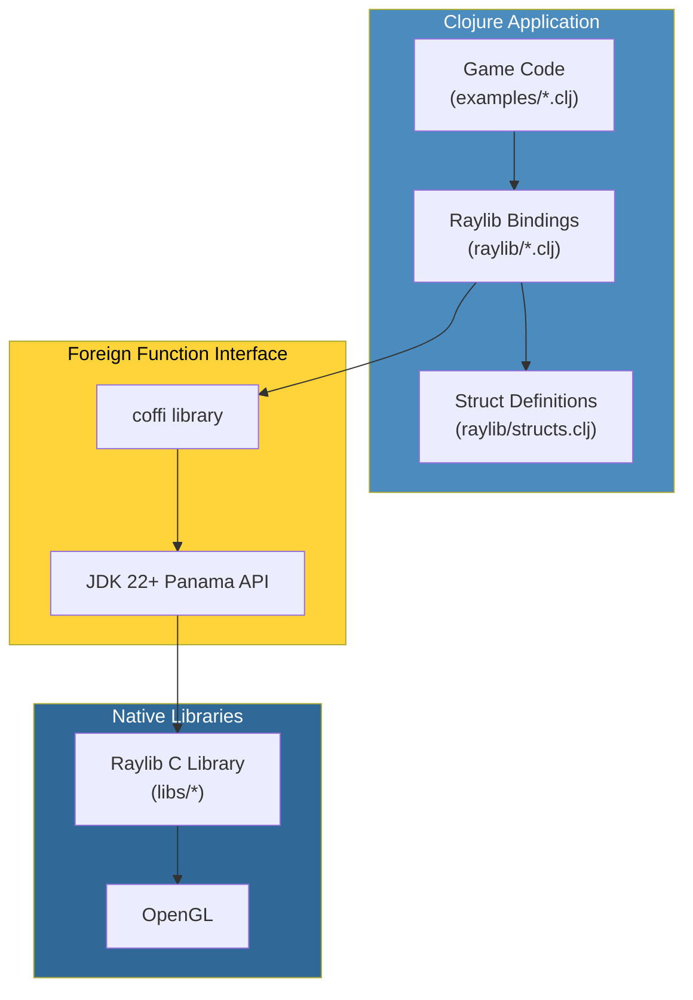
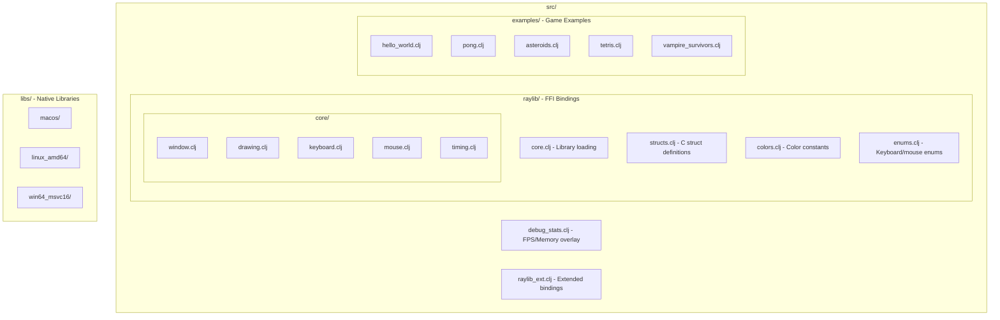

# Architecture

## Overview



## Module layout

- `src/raylib/` — FFI bindings (this is the library)
  - `core.clj` — loads the native library; every binding namespace requires this first
  - `structs.clj` — C struct definitions via `defalias` (Color, Vector2, Vector3, Vector4, Texture, RenderTexture, Rectangle)
  - `colors.clj` — color constants (raywhite, red, etc.)
  - `enums.clj` — keyboard/mouse enums
  - `internals.clj` — internal helpers (ubyte, bool types)
  - `utils.clj` — utility functions (random, fade, etc.)
  - `audio.clj` — audio functions (Music, Sound)
  - `lights.clj` — shader-lighting helpers, based on raylib's `rlights.h`
  - `nrepl.clj` — embedded nREPL server startup, powers the port 7888/7889 live-development workflow
  - `core/` — window, drawing, keyboard, mouse, timing, camera2d, camera3d, collision, gamepad, gestures, shaders
    - `window.clj` — window management
    - `drawing.clj` — drawing primitives
    - `keyboard.clj` — keyboard input
    - `mouse.clj` — mouse input
    - `timing.clj` — frame timing (FPS, delta time)
    - `camera2d.clj` — 2D camera
    - `camera3d.clj` — 3D camera and rendering
    - `collision.clj` — ray casting and collision detection
    - `gamepad.clj` — gamepad input
    - `gestures.clj` — touch gesture detection
    - `shaders.clj` — shader loading and management
  - `text/`, `shapes/`, `textures/` — drawing/loading helpers
- `src/examples/` — the 78 example namespaces (54 top-level + 3 in `games/` + 21 in `models/`)
- `src/debug_stats.clj` — F1 overlay plugin (see [Example Architecture Patterns](example-architecture-patterns.md) for usage)
- `src/raylib_ext.clj` — extended/derived bindings not in core raylib
- `libs/` — bundled native libraries per platform

## Project structure diagram



## Bundled libraries

This project includes pre-built Raylib 5.5.0 libraries for different platforms:

| Platform | Directory | Library |
|----------|-----------|---------|
| macOS (Intel/ARM) | `libs/macos` | `libraylib.5.5.0.dylib` |
| Linux 64-bit | `libs/linux_amd64` | `libraylib.so.5.5.0` |
| Linux 32-bit | `libs/linux_i386` | `libraylib.a` |
| Windows 64-bit | `libs/win64_msvc16` | `raylib.dll` |
| Windows 32-bit | `libs/win32_msvc16` | `raylib.dll` |

The correct library is loaded automatically based on your operating system.

## macOS code signing

On macOS, you might see a security warning about the library. Fix it with:

```bash
bb macos:sign-lib
```

Or manually:

```bash
codesign --force --sign - libs/macos/libraylib.5.5.0.dylib
```
