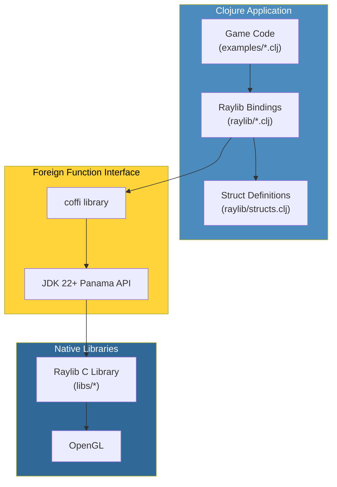
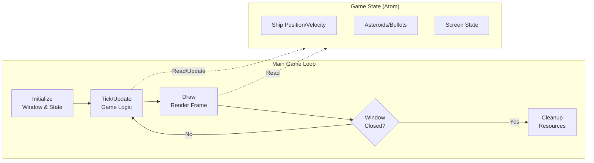
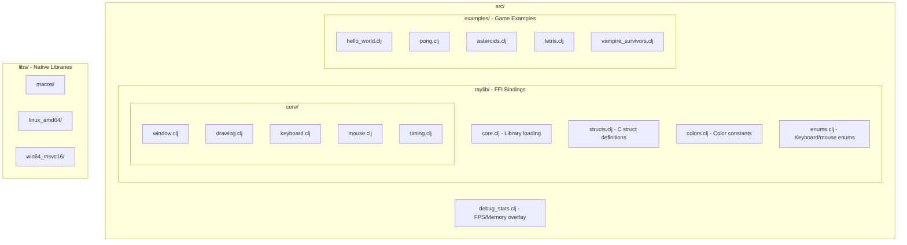

# Architecture

## Overview



## Game Loop Architecture



## Module layout

- `src/raylib/`: FFI bindings (this is the library)
  - `core.clj`: loads the native library; every binding namespace requires this first
  - `structs.clj`: C struct definitions via `defalias` (Color, Vector2, Vector3, Vector4, Texture, RenderTexture, Rectangle)
  - `colors.clj`: color constants (raywhite, red, etc.)
  - `enums.clj`: keyboard/mouse enums
  - `internals.clj`: internal helpers (ubyte, bool types)
  - `utils.clj`: utility functions (random, fade, etc.)
  - `audio.clj`: audio functions (Music, Sound)
  - `lights.clj`: shader-lighting helpers, based on raylib's `rlights.h`
  - `easings.clj`: all 28 easing curves, based on raylib's `reasings.h`
  - `raymath.clj`: scalar, Vector2 and Vector3 maths, based on raylib's `raymath.h`
  - `raygui.clj`: the raygui controls the examples use, based on `raygui.h`
  - `nrepl.clj`: embedded nREPL server startup, powers the port 7888 live-development workflow
  - `core/`: window, drawing, keyboard, mouse, cursor, timing, camera2d, camera3d, collision, gamepad, gestures, shaders
    - `window.clj`: window management
    - `drawing.clj`: drawing primitives
    - `keyboard.clj`: keyboard input
    - `mouse.clj`: mouse input
    - `cursor.clj`: cursor visibility and lock state
    - `timing.clj`: frame timing (FPS, delta time)
    - `camera2d.clj`: 2D camera
    - `camera3d.clj`: 3D camera and rendering
    - `collision.clj`: ray casting and collision detection
    - `gamepad.clj`: gamepad input
    - `gestures.clj`: touch gesture detection
    - `shaders.clj`: shader loading and management
  - `text/`, `shapes/`, `textures/`: text, shape and texture bindings
- `src/examples/`: the 106 example namespaces (82 top-level + 3 in `games/` + 21 in `models/`)
- `src/debug_stats.clj`: F1 overlay plugin (see [Example Architecture Patterns](example-architecture-patterns.md) for usage)
- `libs/`: bundled native libraries per platform

## Bound, or ported?

Most of `src/raylib/` is bindings: a `defcfn` names a C symbol and its
types, and Panama builds the call. Four namespaces are not. `lights.clj`,
`easings.clj`, `raymath.clj` and `raygui.clj` are Clojure ports of code
raylib ships *beside* the library rather than inside it - `rlights.h`,
`reasings.h`, `raymath.h` and `raygui.h`.

That distinction matters because it decides whether a binding is even
possible:

- **`rlights.h`, `reasings.h` and `raygui.h` compile into whatever
  includes them.** The bundled `libraylib` exports no symbols for them at
  all - zero `Gui*` entries in `nm` output - so there is nothing a
  `defcfn` could point at. Porting is the only option.
- **`raymath.h` is the exception: its symbols *are* exported**, because on
  Unix shared builds `RMAPI` expands to
  `__attribute__((visibility("default")))`. It is ported anyway, for cost
  rather than necessity: a foreign call to add two floats is far more
  expensive than the addition.

A useful corollary when adding bindings. The header in a raylib checkout
is not the list of what you can call - the bundled library is. This repo
ships raylib 5.5.0, and 27 functions declared in raylib's current header
are absent from it. Binding one of those compiles cleanly and then fails
at runtime with a null function-pointer call, which surfaces as a
`SIGSEGV` at address zero rather than as a missing-symbol message. Check
against the library:

```bash
nm -gU libs/macos/libraylib.5.5.0.dylib | awk '{print $3}' | sed 's/^_//' | sort -u
```

## Project structure diagram



## Bundled libraries

This project includes pre-built Raylib 5.5.0 libraries for different platforms:

| Platform | Directory | Library |
|----------|-----------|---------|
| macOS (Intel/ARM) | `libs/macos` | `libraylib.5.5.0.dylib` |
| Linux 64-bit | `libs/linux_amd64` | `libraylib.so.5.5.0` |
| Linux 32-bit | `libs/linux_i386` | `libraylib.a` |
| Windows 64-bit | `libs/win64_msvc16` | `raylib.dll` |
| Windows 32-bit | `libs/win32_msvc16` | `raylib.dll` |

The correct library is loaded automatically based on your operating system.

## macOS code signing

On macOS, you might see a security warning about the library. Fix it with:

```bash
bb macos:sign-lib
```

Or manually:

```bash
codesign --force --sign - libs/macos/libraylib.5.5.0.dylib
```
