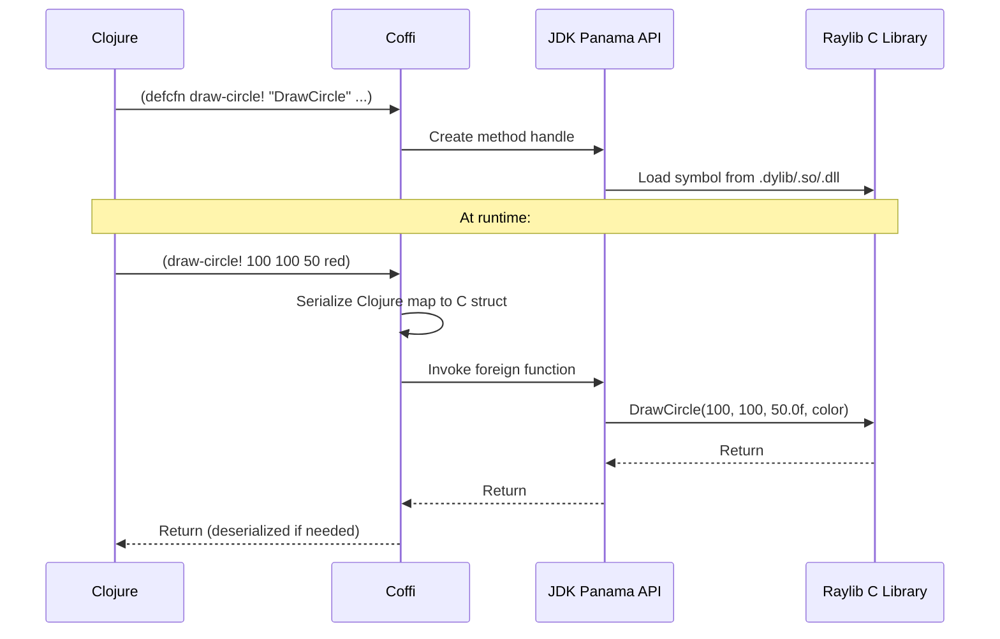

# Coffi and the JDK Panama FFI

## Why JDK 22+

This project uses [coffi](https://github.com/IGJoshua/coffi) to call
Raylib's C library directly from Clojure. Coffi is built on the JDK's
**Foreign Function & Memory API** (Project Panama), and that API only
reached stable (non-preview) status in **JDK 22** — earlier JDK
versions only had it available behind a preview flag. Coffi depends on
the stable API, which is why this project requires JDK 22 or newer:

> This project uses **coffi** for calling native C code from Clojure.
> Coffi requires JDK 22+ because that's when the **Foreign Function and
> Memory API (Project Panama)** became stable. Earlier JDK versions had
> this API in preview mode.

## What happens when `defcfn` is evaluated



1. **Load time.** When a `defcfn` form like
   `(defcfn init-window! "Initialize window..." "InitWindow" [...] ::mem/void)`
   is evaluated, coffi asks the JDK Panama API to create a **method
   handle** bound to the named C symbol (`"InitWindow"`). Panama
   resolves that symbol against the already-loaded `libraylib` shared
   library. This only works because `raylib.core` — required first by
   every binding namespace — has already loaded the native library by
   the time any `defcfn` in that namespace runs; without it, the
   symbol lookup has nothing to search.

2. **Call time.** Every time Clojure calls the function `defcfn`
   defined (e.g. `(draw-circle! 100 100 50 red)`), coffi serializes
   the Clojure arguments into native memory laid out according to
   their declared types — a plain value like an int passes straight
   through, while a struct argument (a map like
   `{:r 255 :g 0 :b 0 :a 255}`) gets written into memory following the
   field layout its `defalias` declared. Coffi then invokes the
   foreign function through the method handle created at load time.
   If the C function returns a struct, coffi deserializes the
   returned native memory back into a Clojure map before handing
   control back to the caller.

## Memory arenas

The `update-camera` example in
[Adding a new FFI binding](adding-ffi-bindings.md#pointer-inout-parameters)
uses `mem/confined-arena` to allocate a native memory segment by hand
— that page walks through each call; this section explains what the
arena itself is.

A **confined arena** owns the lifetime of the native memory segments
allocated from it. It's scoped to the thread and block that created
it: the segment `mem/alloc-instance` allocates from a confined arena
stays valid only until that arena closes, at which point the native
memory is freed. This matters because Panama's native memory isn't
garbage-collected by the JVM — something has to own and release it
explicitly, and the arena is that owner.

You only need to reach for an arena yourself when you're **explicitly
allocating a segment for an in/out pointer parameter** — the
`update-camera` case, where raylib mutates a `Camera3D*` in place. For
ordinary struct arguments passed by value (like `draw-cube!`'s
`::rs/vector-3` and `::rs/color` parameters), coffi manages the
serialization memory automatically per-call; there's no arena to think
about.

## Why macOS needs `-XstartOnFirstThread`

OpenGL on macOS requires all GL calls to happen on the process's main
thread. This project configures that in `deps.edn`'s `jvm-opts`
(`grep -n "XstartOnFirstThread" deps.edn`), which every example alias
carries:

```clojure
:jvm-opts ["--enable-native-access=ALL-UNNAMED"
           "-XstartOnFirstThread"
           "-Djava.library.path=libs:libs/macos:..."]
```

The practical consequence: **you cannot open a raylib window from a
plain `clj -M:dev` REPL on macOS.** This is *not* because the
standalone `:dev` alias omits the flag — it doesn't. `grep -n "XstartOnFirstThread" deps.edn` shows the flag
present in every single alias in the file, `:dev` included:

```clojure
:dev
{:jvm-opts ["--enable-native-access=ALL-UNNAMED"
            "-XstartOnFirstThread"
            "-Djava.library.path=libs:libs/macos:..."]
 :main-opts ["-m" "nrepl.cmdline" "--port" "7999"]}
```

`deps.edn` flags the limitation itself, with a comment right above
`:dev`:

```clojure
;; Note: On macOS, you cannot run GUI code from this REPL due to -XstartOnFirstThread
```

Beyond that comment, this repo doesn't document the exact mechanism,
so this guide won't invent one — the flag is present either way, and
having it present is not sufficient to make GUI calls work from
`:dev`. What's verified is the practical rule: a raylib window works
from the game aliases (`bb asteroids`, `clj -M:hello-world`, etc.,
which call `init-window!` directly from their own `-main` at process
start) but not from a standalone `:dev` REPL session evaluating the
same call interactively. If you need a raylib window, run an example
directly and connect to its embedded nREPL (port 7888) instead of
trying to open one from `:dev`'s REPL (port 7999).

## See also
- [`adding-ffi-bindings.md`](adding-ffi-bindings.md) — the practical
  guide to writing a new binding using these mechanics
- [`repl-workflow.md`](repl-workflow.md) — the live consequence of the
  macOS main-thread requirement on REPL workflow
