# Full-size demo gallery

Every example at full size — linked from
[the example catalog](example-catalog.md)'s preview thumbnails.
Recorded via [cgevent](https://github.com/burinc/b12n-cgevent), driven by
the [`screen-grab`](https://github.com/burinc/b12n-screen-grab) CLI and
configured by
[`scripts/demo_manifest.edn`](../../scripts/demo_manifest.edn). Regenerate
with `bb record`.

## 🎮 Original games (9)

### hello-world

the minimal raylib window + text (Q exits, F1 toggles debug stats)

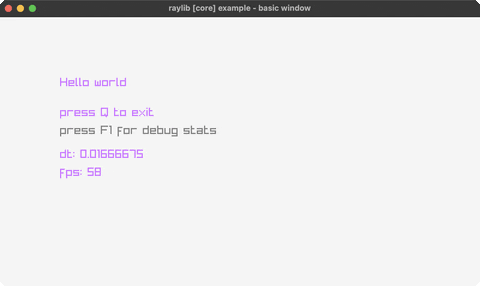

### pong

two-paddle classic, P1 (W/S) vs P2 (K/J)

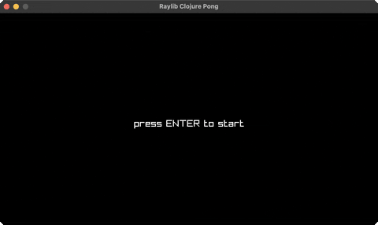

### asteroids

the classic vector shooter (rotate/thrust/fire)

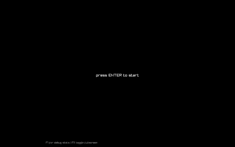

### asteroids2

an alternate asteroids build (rotate/thrust/fire)

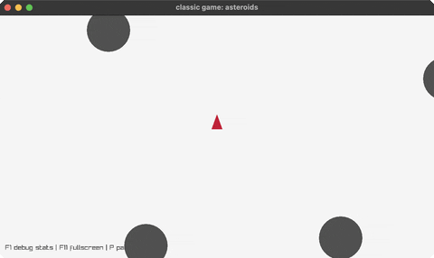

### tetris

the block-stacking puzzle (move/rotate/drop)

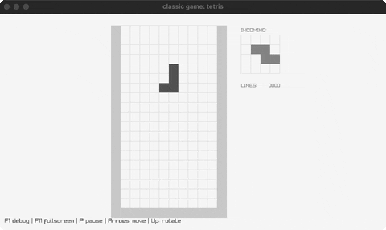

### vampire-survivors

auto-fire survival: move (WASD), waves chase you

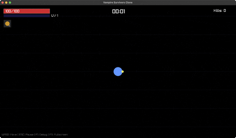

### snake

the classic snake (arrow keys, grow, don't crash)

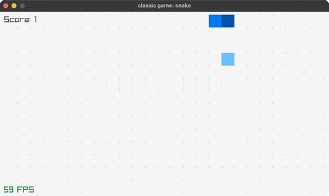

### floppy

flap through the pipe gaps (SPACE)

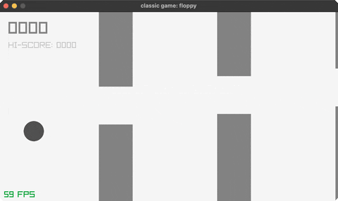

### retro-maze-3d

a GameBoy-style 3D maze escape (WASD + mouse look)

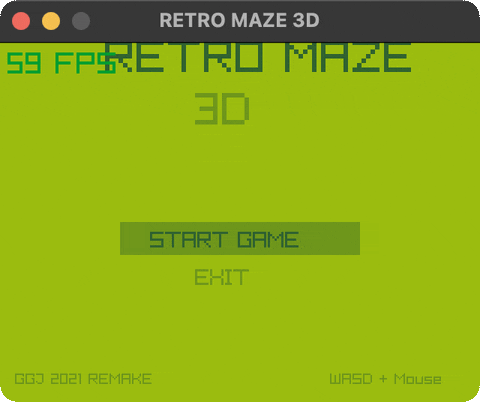

## 📦 Core (23)

### bouncing-ball

a ball bouncing around the window (SPACE pauses, G toggles gravity)

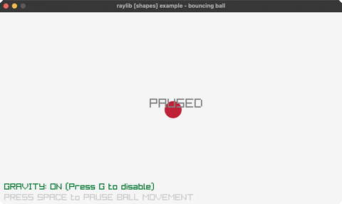

### following-eyes

two eyes track the mouse

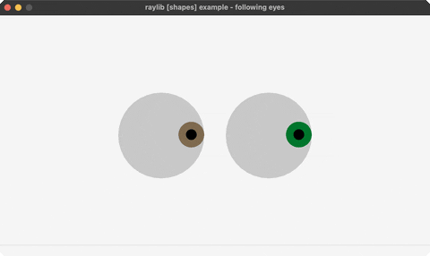

### screen-manager

a LOGO/TITLE/GAMEPLAY/ENDING state flow (ENTER advances)

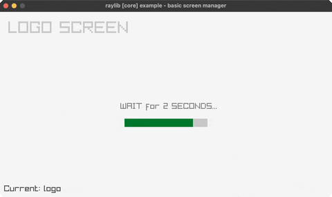

### input-keys

steer a ball with the arrow keys

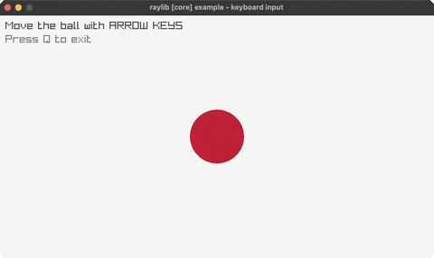

### input-mouse

a ball follows the mouse; click to recolor

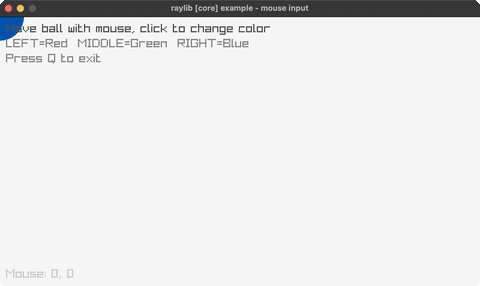

### input-gamepad

a live gamepad axis/button readout

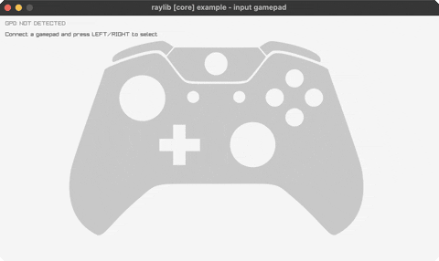

### mouse-wheel

scroll a box with the mouse wheel

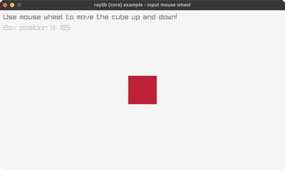

### gestures-testbed

a testbed for raylib's touch/click gesture detection

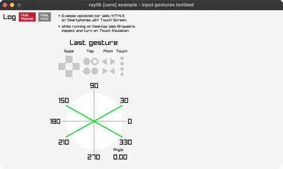

### scissor-test

a scissor rectangle clips a grid (S toggles, mouse moves it)

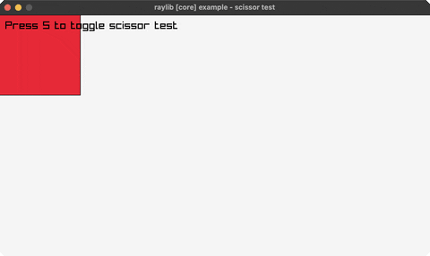

### random-values

a new random value every two seconds

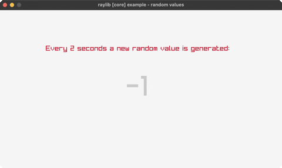

### camera-2d

a 2D camera over a scene (arrows pan, A/S rotate, wheel zooms)

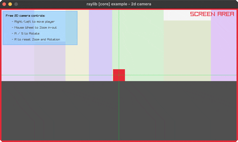

### camera-3d-free

a free-orbit 3D camera (mouse look, wheel zoom)

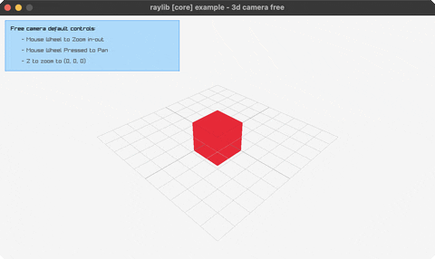

### split-screen-3d

two 3D viewports, one per player (W/S, UP/DOWN)

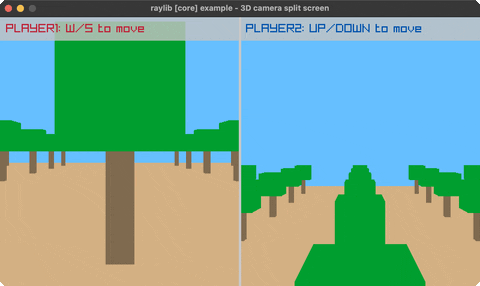

### first-person-3d

a first-person camera walkthrough (WASD + mouse, 1-4 switch modes)

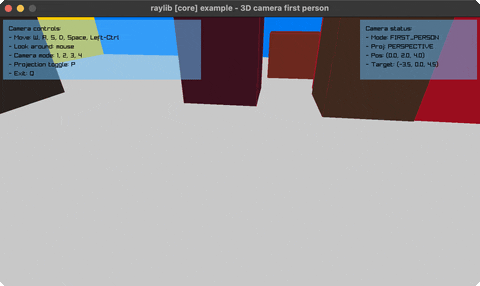

### camera-fps

an FPS camera with jump/crouch physics (WASD, Space, Ctrl)

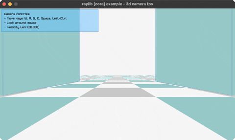

### world-screen

project 3D world points to 2D screen space (mouse, wheel)

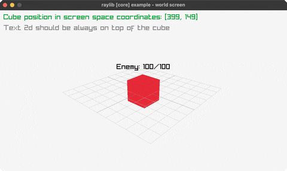

### picking-3d

click to raycast and pick a 3D cube

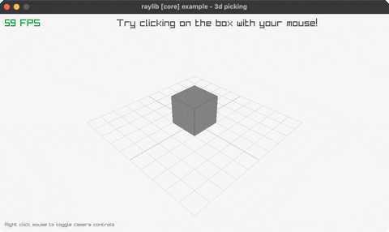

### collision-area

AABB collision between two boxes (mouse moves, SPACE)

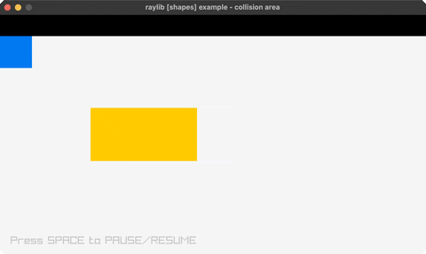

### colors-palette

every named raylib color in a grid (hover, SPACE)

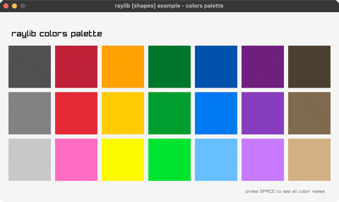

### logo-anim

the raylib logo animating in (R replays)

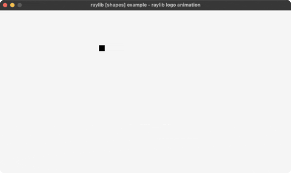

### window-should-close

intercept the close button with a Y/N confirm

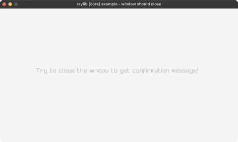

### camera-2d-platformer

5 platformer camera-follow styles (SPACE cycles, C/R/wheel)

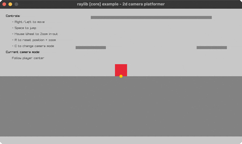

### window-letterbox

resolution-independent rendering via letterboxing (SPACE, resize)

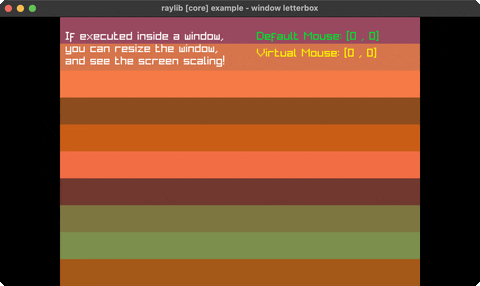

## 🔷 Shapes (15)

### logo-raylib

the raylib logo built from rectangles + text

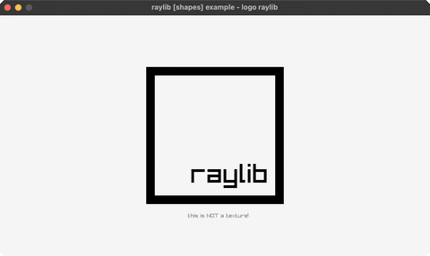

### logo-raylib-anim

the logo animating together, piece by piece (R replays)

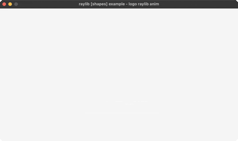

### basic-shapes

circles, rectangles, triangles, polygons + an rlgl triangle

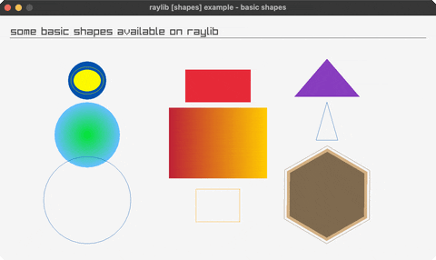

### rectangle-scaling

drag the bottom-right corner to resize a rectangle

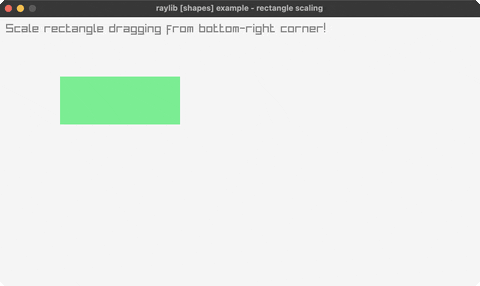

### mouse-trail

a fading trail follows the cursor

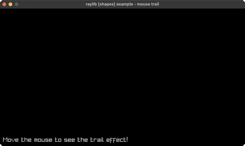

### lines-bezier

a cubic bezier curve — drag the endpoints

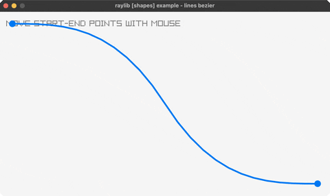

### easings-ball

a ball animating along an easing curve (ENTER replays)

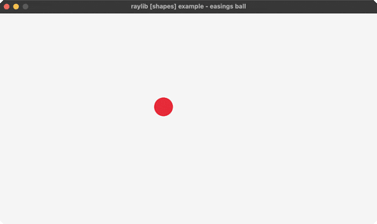

### ball-physics

grab, throw, and resize bouncing balls (click, right-click, wheel)

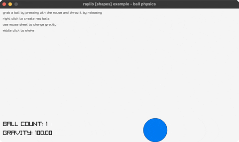

### simple-particles

water/smoke/fire particle effects (arrows switch, click emits)

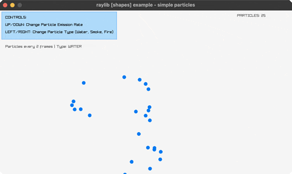

### dashed-line

a dashed line follows the mouse (arrows, C)

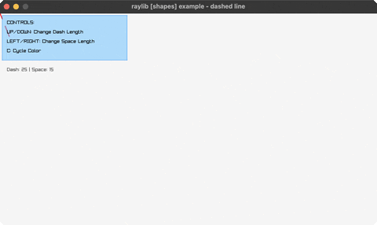

### starfield-effect

a 3D starfield flying toward the camera (SPACE, wheel)

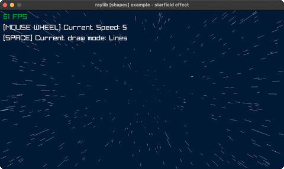

### easings-box

a grid of boxes, each on a different easing curve (SPACE resets)

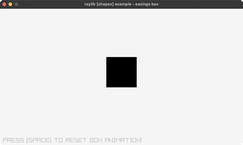

### double-pendulum

chaotic double-pendulum motion + trail

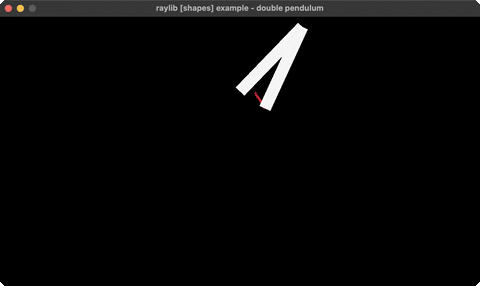

### lines-drawing

click-drag to paint a rainbow fan of thick lines

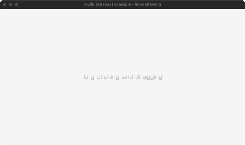

### easings-rectangles

a grid of rectangles animating on easing curves (SPACE replays)

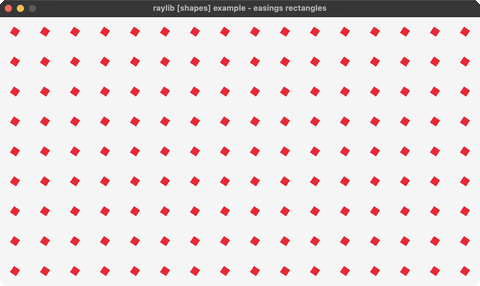

## 📝 Text (3)

### writing-anim

a message types itself out (SPACE speeds up, ENTER restarts)

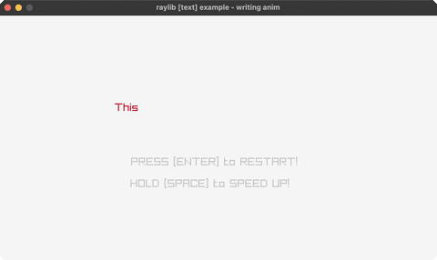

### format-text

padded score + MM:SS timer readouts

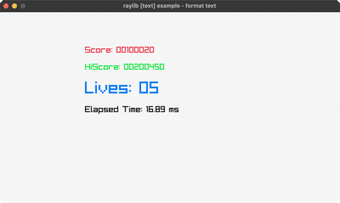

### input-box

type into a text box (click to focus, Backspace to edit)

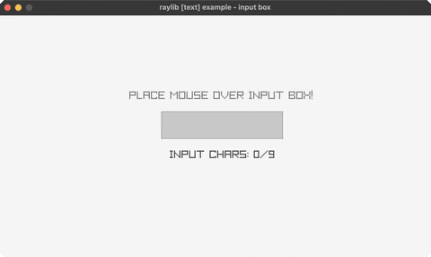

## 🖼️ Textures (2)

### background-scrolling

a parallax-scrolling background

### sprite-animation

a spritesheet character walk cycle (LEFT/RIGHT)

## ✨ Shaders (1)

### basic-lighting

dynamic per-pixel lighting (mouse moves it, Y/R/G/B toggle lights)

## 🔊 Audio (4)

### audio-module

a music-driven waveform/spectrum visualizer

### sound-loading

load and play a WAV/OGG sound effect (SPACE, ENTER)

### music-stream

stream an MP3 with play/pause/seek (SPACE, P, arrows)

### sound-multi

fire the same sound multiple times, overlapping (SPACE)

## 🗿 Models (21)

### geometric-shapes

3D primitive shapes on display

### waving-cubes

an NxN grid of cubes rippling in 3D

### box-collisions

a player cube colliding with 3D boxes (arrow keys)

### orthographic-projection

perspective vs orthographic (SPACE toggles)

### tesseract-view

a rotating 4D hypercube projected to 2D

### solar-system

Sun/Earth/Moon orbiting via the rlgl matrix stack

### spinning-cubes

a row of cubes, each spinning with a color-cycling phase offset

### point-cloud

~1500 points forming a rotating sphere (UP/DOWN adjusts)

### wireframe-shapes

pyramid/octahedron/torus/helix in 3D lines (SPACE cycles)

### camera-modes

Free/Orbital/FPS camera modes (1/2/3 switches, WASD)

### ray-picking

click to select cubes via ray-picking

### bouncing-spheres

spheres bouncing inside a 3D box (SPACE, R, G)

### rotating-cube

a single cube spinning via the rlgl matrix stack (arrows, +/-, R)

### particle-system

a 3D particle emitter (SPACE bursts, G toggles gravity, W/R reset)

### dna-helix

a rotating double-helix structure (arrows, SPACE, R)

### first-person-maze

walk a 3D maze in first person (WASD + mouse, M for map)

### yaw-pitch-roll

yaw/pitch/roll rotation on a 3D model (arrows, SPACE, R)

### lissajous-3d

3D Lissajous parametric curves (1-5 picks a pattern, W/S, SPACE)

### lorenz-attractor

the Lorenz attractor's chaotic butterfly path (1-3, arrows, SPACE, R)

### terrain-generation

procedurally generated terrain (1-3 picks an algorithm, G, W, SPACE)

### mesh-generation

procedurally generated 3D meshes (Left/Right cycles, click, SPACE, R)

