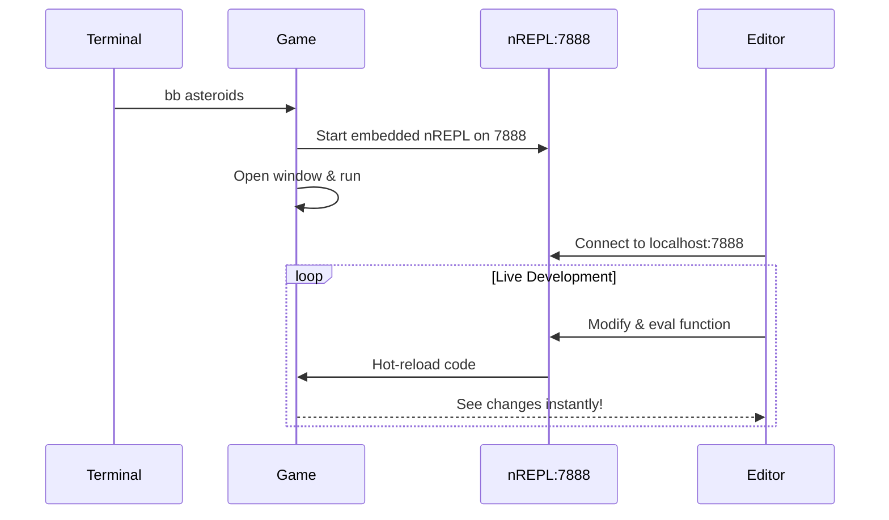

# REPL workflow

One of the best things about Clojure is the REPL workflow: you can
change code while a game is running and see the change immediately.

## Two REPL modes

| | Embedded (game) | Standalone |
|---|---|---|
| Port | 7888 | 7999 |
| Start | `bb <example>` | `bb nrepl` |
| Can open a window (macOS) | Yes | No |

## Live game development (recommended)

Each game starts an **embedded nREPL server on port 7888**. This is
the proper way to do live development:



**Step 1:** Start a game (it launches nREPL automatically):

```bash
bb asteroids   # or: clojure -M:asteroids
```

You'll see in the logs:
```
INFO: starting nREPL server on port 7888
```

**Step 2:** Connect your editor to `localhost:7888`:
- **VS Code/Calva**: Run "Calva: Connect to a Running REPL Server"
- **IntelliJ/Cursive**: Run → Edit Configurations → Remote REPL

**Step 3:** Modify code live! Try these from your connected REPL:

```clojure
;; Access the running game state
@examples.asteroids/game-atom

;; Reset the game
(reset! examples.asteroids/game-atom (examples.asteroids/initial-state))

;; Make the ship bigger
(swap! examples.asteroids/game-atom assoc-in [:ship :size] 50)

;; Spawn more asteroids
(swap! examples.asteroids/game-atom update :asteroids 
       concat (repeatedly 5 examples.asteroids/make-asteroid))
```

## Why macOS can't open windows from a standalone REPL

On macOS, you cannot open a raylib window from the standalone `:dev`
REPL — only from a game alias (`bb asteroids`, `clj -M:hello-world`,
etc.) started fresh, which is why live game development connects to
the game's own embedded nREPL instead of running the game from
`:dev`. See
[Coffi & Panama Internals](coffi-panama-internals.md#why-macos-needs--xstartonfirstthread)
for the `-XstartOnFirstThread` flag and exactly what is (and isn't)
verified about why this is the rule.

## Standalone REPL for non-GUI work

For exploring code, testing logic, or non-GUI work, use the standalone REPL:

```bash
bb nrepl   # or: clj -M:dev (starts on port 7999)
```

> **Port note:** Standalone REPL uses port **7999** to avoid conflicts with games that use **7888**.

What works from standalone REPL:

```clojure
;; Load and explore FFI bindings
(require '[raylib.colors :as colors])
(require '[raylib.enums :as enums])

;; Colors are just Clojure maps!
colors/red
;; => {:r 230, :g 41, :b 55, :a 255}

;; Create custom colors
(def my-purple {:r 128 :g 0 :b 255 :a 255})

;; Test game logic (pure functions)
(require '[examples.asteroids :as ast])

(ast/vector-add [1 2] [3 4])
;; => [4 6]

(ast/check-point-circle [100 100] [100 100] 50)
;; => true (collision!)

;; Explore game state structure
(keys (ast/initial-state))
;; => (:bullets :screen :dt :alive :asteroids :ship ...)
```

## REPL capability summary

| Capability | Standalone REPL | Connected to Game |
|------------|-----------------|-------------------|
| Load FFI bindings | ✅ | ✅ |
| Inspect colors/enums | ✅ | ✅ |
| Test pure game logic | ✅ | ✅ |
| Open windows/render | ❌ (macOS) | ✅ |
| Modify running game | ❌ | ✅ |
| Hot-reload functions | ❌ | ✅ |
